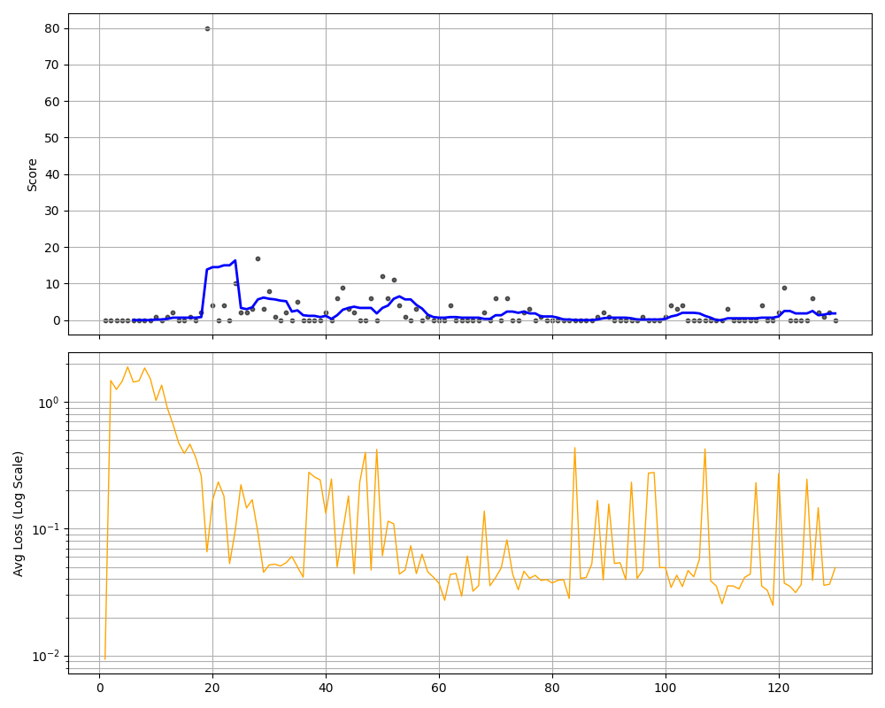

# Flappy Bird AI: Lidar & Curriculum Learning Agent

**Course:** Mobile Robot Navigation with Artificial Intelligence (700.204, 25W)
**Group:** A

## Team Members
* Fahad Ali Jalil
* Randika
* Ayosh

## Project Overview
This project implements a highly efficient Reinforcement Learning (RL) agent that masters Flappy Bird using Linear Approximation and Curriculum Learning.

Unlike traditional methods that rely on raw pixels (CNNs), this agent simulates "Lidar" sensors to perceive the environment (Distance & Velocity). This mimics human-like cognitive simplification, reducing training time from hours to minutes while achieving superior stability.

## Technical Architecture

### 1. State Space (The Eyes)
Instead of processing images, the agent utilizes a Lidar Sensor Vector with 3 normalized features:
* **dist_x**: Horizontal distance to the next pipe.
* **dist_y**: Vertical distance to the center of the safe gap.
* **velocity**: The bird's current vertical speed.

### 2. Model: Deep Dense Network (The Brain)
We utilize a fully connected Linear Neural Network (DQN):
* **Input Layer:** 3 Nodes (The Sensor Data)
* **Hidden Layers:** 2x Layers of 128 Neurons (ReLU Activation)
* **Output Layer:** 2 Nodes (Action: Flap or Do Nothing)

### 3. Curriculum Learning (The Teacher)
To prevent the "early crash" problem, the environment adapts its difficulty dynamically during training:
* **Phase 1 (0 - 200k iters):** "Easy Mode" (Gap size: 200px). The bird learns basic physics without punishing precision.
* **Phase 2 (200k - 1M iters):** "Transition Phase". The gap linearly shrinks from 200px to 100px.
* **Phase 3 (1M+ iters):** "Hard Mode" (Gap size: 100px). Standard tournament difficulty.

### 4. Reward Shaping
* **Standard:** +1 for passing a pipe.
* **Progressive:** +1 bonus for every 5th pipe (Total +2).
* **Victory Lap:** +10 Bonus for passing 100 pipes, followed by an immediate win condition to reinforce successful episodes.
* **Death Penalty:** -10 for collision.

---

## Installation & Usage

Follow these steps to set up the environment and run the training.

### Prerequisites
* Python 3.8+
* Git

### Setup Commands

```bash
# 1. Clone the Repository
git clone https://github.com/faadj/flappybird_DQN.git
cd flappybird_DQN

# 2. Install Dependencies
# It is recommended to use a virtual environment
pip install torch numpy pygame opencv-python matplotlib imageio tensorboardX

# 3. Train the Agent
# To start training from scratch (Begins in Easy Mode)
python train.py

# 4. Visualization Mode (Augmented Reality)
# To watch the training with Lidar Laser Lines drawn on the screen
python train.py --vis
# Red Line: Horizontal Distance
# Green Line: Vertical Distance
# Blue Dot: Target Tracking Point

### Training Progress

